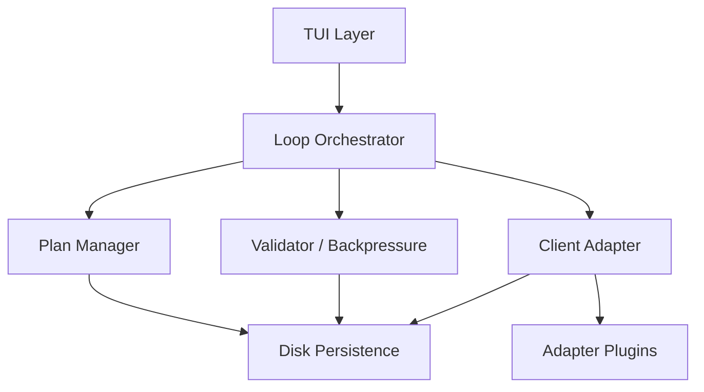
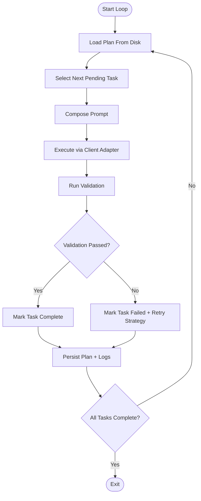
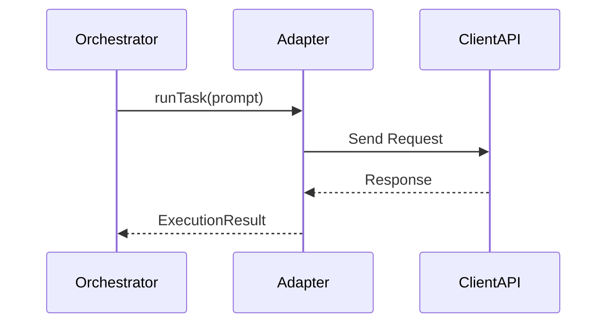
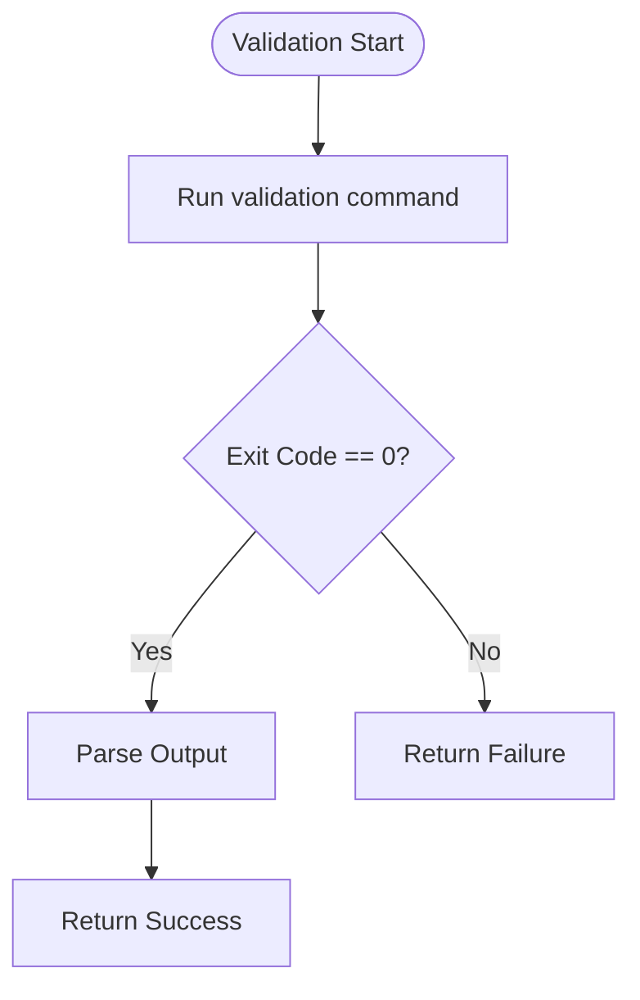

# 📘 Product Requirements Document

# Multi-Client Ralph Workflow TUI

---

## 1. Executive Summary

This document specifies a **Terminal User Interface (TUI)** system that executes a structured Ralph-style autonomous workflow while remaining **client-agnostic**.

The system orchestrates:

- Task selection
- Agent execution
- Validation (backpressure)
- Plan mutation
- Iterative execution loops

### The system must:

- Execute a disk-backed structured workflow
- Be decoupled from any single AI client (e.g., Claude Code)
- Provide high-visibility terminal UX for monitoring and control
- Enforce strict iteration isolation (fresh context per loop)
- Support pluggable adapters

This PRD includes architecture, detailed workflow logic, UI wireframes, and Mermaid diagrams.

---

# 2. Background: Ralph Workflow Model

The Ralph methodology is a structured autonomous implementation loop with strict iteration isolation and disk-based state.

## Core Ralph Principles

### 1. Spec-Driven Development

- PRD or specification defines scope
- Implementation plan decomposes work into atomic tasks

### 2. Atomic Tasks

- Each task must fit within a single context window
- Tasks must be independently verifiable

### 3. Fresh Iteration Context

- Each loop is stateless in memory
- State is recomputed from disk

### 4. Backpressure Enforcement

- Tests, builds, linters, or validation gates must pass before marking task complete

### 5. Persistent Plan Mutation

- Task statuses updated on disk
- Plan evolves over time

---

# 3. Product Goals

## 3.1 Functional Goals

- Execute a Ralph loop autonomously
- Support multiple AI clients through adapters
- Provide clear terminal UX
- Resume safely after crash
- Maintain deterministic disk-backed state

## 3.2 Non-Goals

- Not a GUI application
- Not tied to any specific model vendor
- Not a replacement for CI systems
- Not a full IDE

---

# 4. Users

## Primary Users

- Autonomous workflow engineers
- Tooling engineers
- AI research engineers

## Secondary Users

- Product managers monitoring progress
- Open-source maintainers

---

# 5. High-Level Architecture

## 5.1 System Components

- TUI Layer
- Orchestrator Engine
- Plan Manager
- Client Adapter Interface
- Validator (Backpressure Engine)
- Persistence Layer
- Plugin Loader

---

## 5.2 Architecture Diagram



---

# 6. Detailed Ralph Workflow

## 6.1 Loop Lifecycle

Each iteration performs:

1. Load disk state
2. Select next task
3. Generate task prompt
4. Execute via client adapter
5. Run validation
6. Update plan
7. Persist changes
8. Repeat or exit

---

## 6.2 Detailed Loop Diagram



---

## 6.3 State Model

State must be entirely disk-driven.

### Required Files

- `PRD.md`
- `IMPLEMENTATION_PLAN.md`
- `tasks.json` (optional structured version)
- `logs/iteration_<n>.log`
- `.ralph/state.json`

---

## 6.4 Task Schema

```json
{
  "id": "T-14",
  "title": "Implement authentication middleware",
  "description": "...",
  "priority": 2,
  "status": "pending | in_progress | failed | complete",
  "retry_count": 0,
  "validation_command": "npm test"
}
```

---

# 7. Client Adapter System

## 7.1 Design Goals

- Decoupled from orchestration logic
- Uniform execution interface
- Pluggable via dynamic loading

---

## 7.2 Adapter Interface

```ts
interface RalphClientAdapter {
  name: string;
  initialize(config: AdapterConfig): Promise<void>;
  runTask(prompt: string, context: DiskContext): Promise<ExecutionResult>;
  validateResult?(result: ExecutionResult): Promise<ValidationHint>;
  shutdown(): Promise<void>;
}
```

---

## 7.3 Adapter Execution Flow



---

# 8. Validation (Backpressure Engine)

## 8.1 Responsibilities

- Execute validation command
- Capture exit codes
- Parse structured test outputs (optional)
- Enforce gating logic

---

## 8.2 Validation Flow



---

# 9. TUI Design

## 9.1 Design Principles

- Keyboard-driven
- Non-blocking updates
- Real-time streaming logs
- Deterministic layout
- Clear visual state markers

---

# 10. UI Wireframes

---

## 10.1 Main Dashboard View

```text
╔══════════════════════════════════════════════════════╗
║ RALPH TUI  | Project: auth-service  | Client: GPT  ║
╠══════════════════════════════════════════════════════╣
║ Iteration: 12    Loop State: RUNNING               ║
║ Current Task: T-14  Implement auth middleware      ║
╠══════════════════════ PLAN OVERVIEW ════════════════╣
║ [✓] T-01 Setup project scaffold                    ║
║ [✓] T-02 Add linting                               ║
║ [~] T-14 Implement auth middleware                 ║
║ [ ] T-18 Add integration tests                     ║
╠══════════════════════ VALIDATION ═══════════════════╣
║ Last Result: PASS                                  ║
║ Tests: 42/42                                       ║
╠══════════════════════ AGENT LOG STREAM ═════════════╣
║ > Reading task requirements...                     ║
║ > Writing middleware file...                       ║
║ > Running test suite...                            ║
╚══════════════════════════════════════════════════════╝
```

---

## 10.2 Plan Detail View

```text
╔════════════════════════════════╗
║ PLAN DETAIL VIEW              ║
╠════════════════════════════════╣
║ Task ID: T-14                 ║
║ Priority: 2                   ║
║ Retries: 1                    ║
║ Status: In Progress           ║
╠════════════════════════════════╣
║ Description:                  ║
║ Implement JWT validation      ║
║ middleware using library X.   ║
╠════════════════════════════════╣
║ Validation Command:           ║
║ npm test                      ║
╚════════════════════════════════╝
```

---

## 10.3 Adapter Management View

```text
╔══════════════════════════════╗
║ CLIENT CONFIGURATION         ║
╠══════════════════════════════╣
║ Active Adapter: OpenAI       ║
║ Model: gpt-4o                ║
║ Temperature: 0.2             ║
║ Timeout: 120s                ║
╠══════════════════════════════╣
║ Installed Adapters:          ║
║  - OpenAI                    ║
║  - Claude Code               ║
║  - Local LLM                 ║
╚══════════════════════════════╝
```

---

## 10.4 History View

```text
╔══════════════════════════════════════╗
║ ITERATION HISTORY                   ║
╠══════════════════════════════════════╣
║ #10  T-12  PASS  32s                ║
║ #11  T-13  FAIL  14s                ║
║ #12  T-13  PASS  29s                ║
║ #13  T-14  RUNNING                  ║
╚══════════════════════════════════════╝
```

---

# 11. Interaction Model

## Keyboard Controls

|Key|Action|
|---|---|
|q|Quit|
|r|Retry task|
|s|Skip task|
|v|View task detail|
|c|Change client|
|h|View history|
|p|Pause loop|

---

# 12. Error Handling

## Crash Recovery

On startup:

1. Load `.ralph/state.json`
2. Detect incomplete iteration
3. Mark as failed or resume based on config

---

## Adapter Failure Strategy

- Retry configurable **N** times
- Exponential backoff
- Fail task after threshold

---

# 13. Persistence Model

## State File

```json
{
  "current_iteration": 14,
  "current_task_id": "T-14",
  "loop_state": "running",
  "adapter": "openai"
}
```

---

# 14. Extensibility

## Plugin System

- Adapters loaded from `/plugins/adapters`
- Validator hooks extendable
- Prompt templates customizable

---

# 15. Security Requirements

- API keys encrypted at rest
- OS keychain integration
- No plaintext secrets in logs
- Redaction middleware before persistence

---

# 16. Roadmap

## Phase 1

- Core loop
- Single adapter
- Basic TUI

## Phase 2

- Multi-adapter system
- Validation engine
- Resume support

## Phase 3

- Plugin SDK
- CI integration mode
- Distributed execution mode

---

# 17. Acceptance Criteria

- System completes full plan autonomously
- State fully recoverable after forced termination
- Can swap client without modifying orchestrator
- TUI reflects state changes within 200ms
- Validation strictly gates task completion

---

# 18. Open Questions

- Should tasks support parallel execution?
- Should validation support multi-stage gating?
- Should plan auto-refactor when blocked?

---

# 19. Conclusion

This system formalizes a Ralph-style autonomous execution engine within a multi-client terminal interface.

The design enforces:

- Iteration isolation
- Validation gating
- Disk-based state reconstruction
- Adapter extensibility

The result is a deterministic, inspectable, vendor-agnostic autonomous development engine optimized for terminal environments.